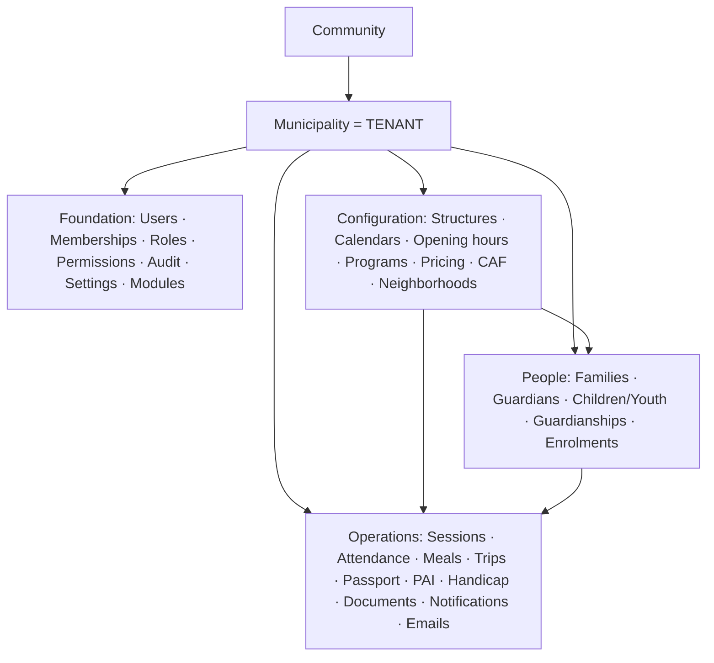
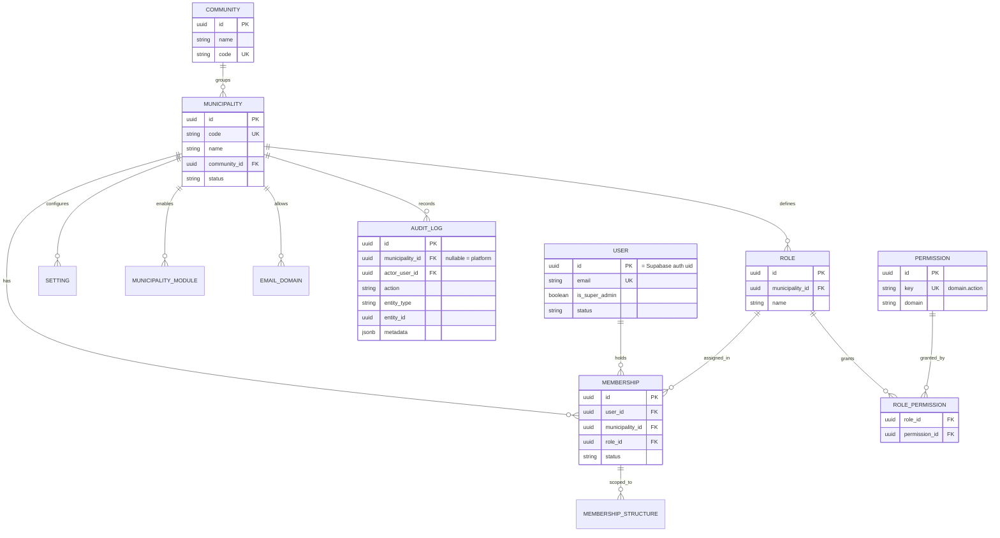
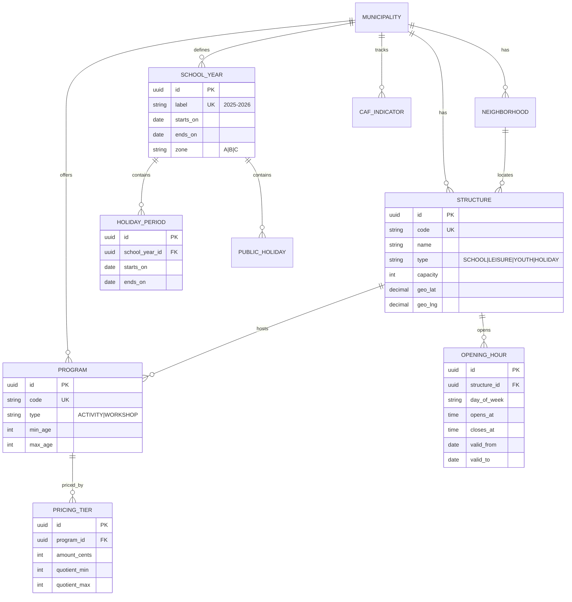
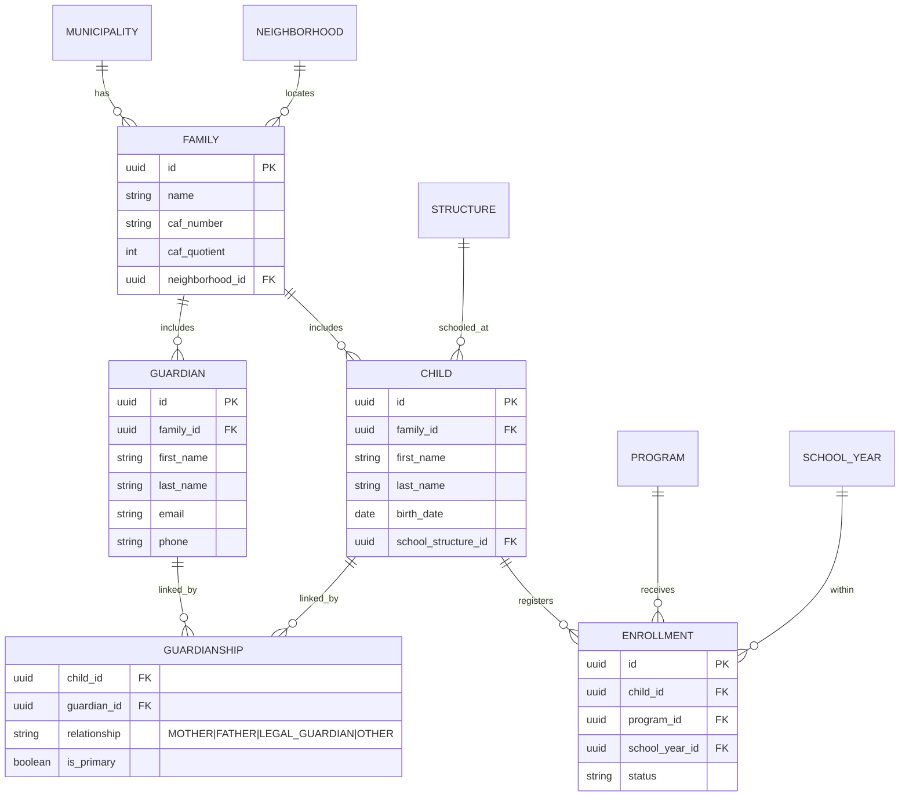
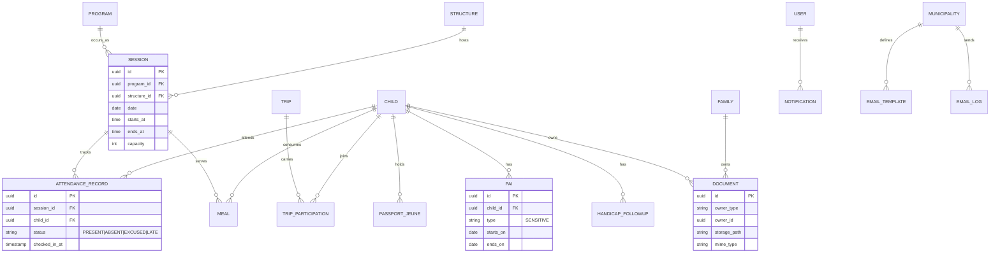

# Entity-Relationship Diagrams

Diagrams render on GitHub (Mermaid). Attributes are trimmed to the essential/keys for readability — full columns are in [entities.md](entities.md). Every tenant-scoped table also carries the base columns from [database-philosophy.md](../database-philosophy.md) (`municipality_id`, timestamps, audit-actor, soft-delete) even where not drawn.

Legend: `||--o{` = one-to-many · `}o--o{` = many-to-many (via join) · `||--||` = one-to-one.

---

## 1. Context (how the layers relate)

Everything below `Municipality` is tenant-scoped. `Community`, `User`, and the `Permission` catalog are **global** (not owned by a single tenant).

---

## 2. Foundation — tenancy, identity, access, audit

---

## 3. Configuration / structural

---

## 4. People

---

## 5. Operations (first-pass — refined per-domain in Phase 4)

> `PAI` and `HANDICAP_FOLLOWUP` hold **Art. 9 sensitive data** — dedicated permissions + row-level audit (see [security.md](../security.md), [authorization-rbac.md](../authorization-rbac.md)).

Full column-by-column detail, indexes, and constraints for all entities: [entities.md](entities.md).
